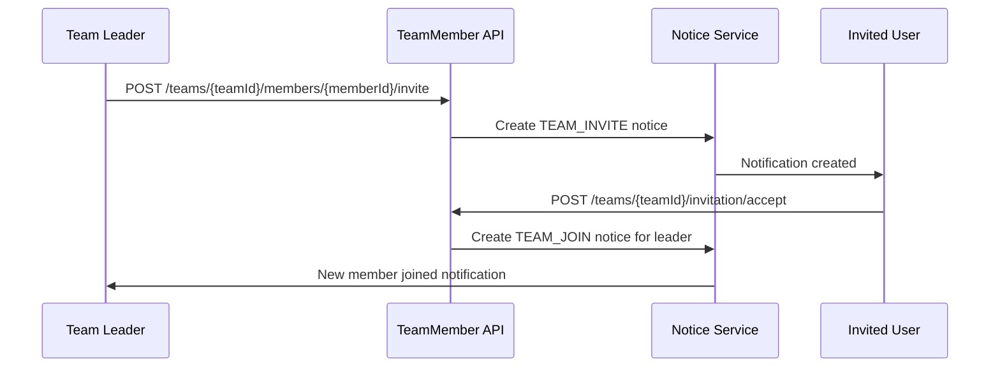
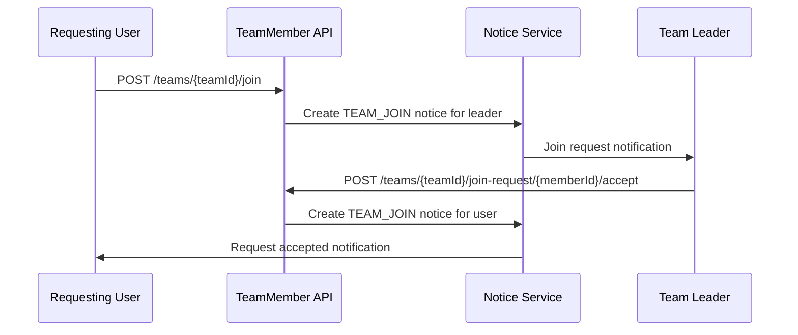
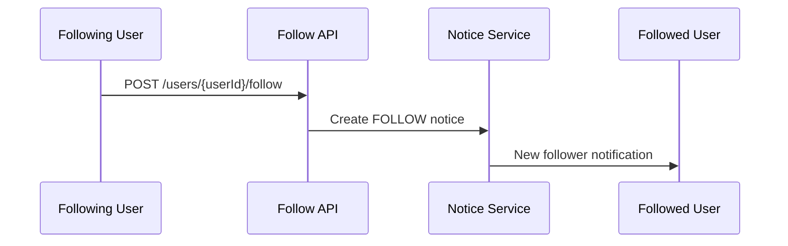

# Notice API Specification

Notice(알림) 관련 API 명세서입니다.

## Base URL

```
/notices
```

## Authentication

모든 Notice API는 JWT 토큰 인증이 필요합니다.

## Endpoints

### 1. Create Notice (Admin/System Only)

```http
POST /notices
Authorization: Bearer {jwt_token}
Content-Type: application/json
```

#### Request Body

```json
{
    "userId": 1,
    "type": "FOLLOW",
    "title": "새로운 팔로워",
    "content": "john_doe님이 회원님을 팔로우하기 시작했습니다.",
    "relatedEntityId": 123,
    "metadata": {
        "followerUserId": 123,
        "followerNickname": "john_doe"
    }
}
```

#### Response

```json
{
    "status": 201,
    "message": "Notice created successfully",
    "data": {
        "id": 1,
        "userId": 1,
        "type": "FOLLOW",
        "title": "새로운 팔로워",
        "content": "john_doe님이 회원님을 팔로우하기 시작했습니다.",
        "isRead": false,
        "relatedEntityType": "follow",
        "relatedEntityId": 123,
        "metadata": {
            "followerUserId": 123,
            "followerUsername": "john_doe"
        },
        "createdAt": "2024-01-15T10:30:00.000Z"
    }
}
```

### 2. Get User Notices

```http
GET /notices?page=1&limit=20&isRead=false&type=FOLLOW
Authorization: Bearer {jwt_token}
```

#### Query Parameters

-   `page` (optional): 페이지 번호 (default: 1)
-   `limit` (optional): 페이지당 항목 수 (default: 20, max: 100)
-   `isRead` (optional): 읽음 상태 필터 (true/false)
-   `type` (optional): 알림 타입 필터 (FOLLOW/TEAM_INVITE/TEAM_JOIN/TEAM_LEAVE/TEAM_KICK/SYSTEM)

#### Response

```json
{
    "status": 200,
    "message": "Notices retrieved successfully",
    "data": {
        "notices": [
            {
                "id": 1,
                "userId": 1,
                "type": "FOLLOW",
                "title": "새로운 팔로워",
                "content": "john_doe님이 회원님을 팔로우하기 시작했습니다.",
                "isRead": false,
                "relatedEntityId": 123,
                "metadata": {
                    "followerUserId": 123,
                    "followerNickname": "john_doe"
                },
                "createdAt": "2024-01-15T10:30:00.000Z"
            }
        ],
        "total": 1,
        "page": 1,
        "limit": 20,
        "hasNext": false
    }
}
```

### 3. Get Unread Notice Count

```http
GET /notices/unread-count
Authorization: Bearer {jwt_token}
```

#### Response

```json
{
    "status": 200,
    "message": "Unread count retrieved successfully",
    "data": {
        "count": 5
    }
}
```

### 4. Mark Notice as Read

```http
PATCH /notices/{noticeId}/read
Authorization: Bearer {jwt_token}
```

#### Path Parameters

-   `noticeId`: 알림 ID

#### Response

```json
{
    "status": 200,
    "message": "Notice marked as read",
    "data": {
        "id": 1,
        "userId": 1,
        "type": "FOLLOW",
        "title": "새로운 팔로워",
        "content": "john_doe님이 회원님을 팔로우하기 시작했습니다.",
        "isRead": true,
        "relatedEntityType": "follow",
        "relatedEntityId": 123,
        "metadata": {
            "followerUserId": 123,
            "followerUsername": "john_doe"
        },
        "createdAt": "2024-01-15T10:30:00.000Z"
    }
}
```

### 5. Mark All Notices as Read

```http
PATCH /notices/read-all
Authorization: Bearer {jwt_token}
```

#### Response

```json
{
    "status": 200,
    "message": "All notices marked as read",
    "data": {
        "updatedCount": 5
    }
}
```

### 6. Delete Notice

```http
DELETE /notices/{noticeId}
Authorization: Bearer {jwt_token}
```

#### Path Parameters

-   `noticeId`: 알림 ID

#### Response

```json
{
    "status": 200,
    "message": "Notice deleted successfully"
}
```

## Notice Types

### FOLLOW

-   사용자가 다른 사용자를 팔로우할 때 발생
-   `relatedEntityId`: 팔로우한 사용자 ID
-   **자동 생성**: Follow 서비스에서 팔로우 시 자동 생성

### TEAM_INVITE

-   팀에 초대받았을 때 발생
-   `relatedEntityId`: 팀 ID
-   **자동 생성**: 팀 리더가 사용자를 초대할 때 자동 생성
-   **관련 액션**: 초대 수락/거절 가능

### TEAM_JOIN

-   새로운 멤버가 팀에 가입했을 때 또는 팀 참여 요청 시 발생
-   `relatedEntityId`: 팀 ID
-   **자동 생성**:
    -   사용자가 팀 참여 요청 시 팀 리더에게 자동 생성
    -   팀 초대 수락 시 팀 리더에게 가입 완료 알림 자동 생성
-   **관련 액션**: 리더는 참여 요청을 수락/거절 가능

### TEAM_LEAVE

-   멤버가 팀을 탈퇴했을 때 팀 소유자에게 발생
-   `relatedEntityId`: 팀 ID
-   **자동 생성**: 팀원이 팀을 떠날 때 자동 생성

### TEAM_KICK

-   팀에서 추방당했을 때 발생
-   `relatedEntityId`: 팀 ID
-   **자동 생성**: 팀 리더가 멤버를 추방할 때 자동 생성

### SYSTEM

-   시스템 공지사항
-   `relatedEntityId`: 없음 (optional)
-   **수동 생성**: 관리자가 직접 생성

## Notification Flow Integration

### Team Invitation Flow



### Team Join Request Flow



### Follow Notification Flow



## Error Responses

### 400 Bad Request

```json
{
    "status": 400,
    "message": "Invalid request data",
    "errors": [
        {
            "field": "type",
            "message": "type must be one of FOLLOW, TEAM_INVITE, TEAM_JOIN, TEAM_LEAVE, TEAM_KICK, SYSTEM"
        }
    ]
}
```

### 401 Unauthorized

```json
{
    "status": 401,
    "message": "Unauthorized"
}
```

### 404 Not Found

```json
{
    "status": 404,
    "message": "Notice not found"
}
```

## Usage Examples

### Following a User (Automatic Notice Creation)

```javascript
// When user A follows user B, a notice is automatically created for user B
// This happens in the follow service, not through direct API call

// The notice created would be:
{
  "userId": "B's user ID",
  "type": "FOLLOW",
  "title": "새로운 팔로워",
  "content": "A님이 회원님을 팔로우하기 시작했습니다.",
  "relatedEntityId": "A's user ID"
}
```

### Team Operations (Automatic Notice Creation)

```javascript
// 1. Team invite notice (to invited user)
{
  "userId": "invited user ID",
  "type": "TEAM_INVITE",
  "title": "팀 초대",
  "content": "team_leader님이 'Team Name' 팀에 초대했습니다.",
  "relatedEntityId": "team ID",
  "metadata": {
    "teamName": "Team Name",
    "inviterName": "team_leader"
  }
}

// 2. Team join request notice (to team leader)
{
  "userId": "team leader ID",
  "type": "TEAM_JOIN",
  "title": "팀 참여 요청",
  "content": "requesting_user님이 'Team Name' 팀 참여를 요청했습니다.",
  "relatedEntityId": "team ID",
  "metadata": {
    "teamName": "Team Name",
    "requesterName": "requesting_user"
  }
}

// 3. Team join acceptance notice (to requesting user)
{
  "userId": "requesting user ID",
  "type": "TEAM_JOIN",
  "title": "팀 참여 승인",
  "content": "'Team Name' 팀 참여가 승인되었습니다.",
  "relatedEntityId": "team ID",
  "metadata": {
    "teamName": "Team Name"
  }
}

// 4. New member joined notice (to team leader when invitation accepted)
{
  "userId": "team leader ID",
  "type": "TEAM_JOIN",
  "title": "새로운 팀원",
  "content": "new_member님이 'Team Name' 팀에 가입했습니다.",
  "relatedEntityId": "team ID",
  "metadata": {
    "teamName": "Team Name",
    "newMemberName": "new_member"
  }
}
```

### Team Member Status and Notifications

| User Action                 | Target User     | Notice Type   | Notice Content                                   |
| --------------------------- | --------------- | ------------- | ------------------------------------------------ |
| Leader invites user         | Invited user    | `TEAM_INVITE` | "leader님이 'Team Name' 팀에 초대했습니다."      |
| User accepts invitation     | Team leader     | `TEAM_JOIN`   | "user님이 'Team Name' 팀에 가입했습니다."        |
| User requests to join       | Team leader     | `TEAM_JOIN`   | "user님이 'Team Name' 팀 참여를 요청했습니다."   |
| Leader accepts join request | Requesting user | `TEAM_JOIN`   | "'Team Name' 팀 참여가 승인되었습니다."          |
| User follows another user   | Followed user   | `FOLLOW`      | "follower님이 회원님을 팔로우하기 시작했습니다." |

### API Integration Examples

#### Getting Team-Related Notifications

```http
GET /notices?type=TEAM_INVITE&type=TEAM_JOIN
Authorization: Bearer {jwt_token}
```

#### Handling Team Invitation

```http
# User sees invitation in notifications
GET /notices?type=TEAM_INVITE

# User accepts invitation through team API
POST /teams/{teamId}/invitation/accept
Authorization: Bearer {jwt_token}

# This automatically creates a TEAM_JOIN notice for the team leader
```

#### Handling Team Join Request

```http
# Leader sees join request in notifications
GET /notices?type=TEAM_JOIN

# Leader accepts the request
POST /teams/{teamId}/join-request/{memberId}/accept
Authorization: Bearer {jwt_token}

# This automatically creates a TEAM_JOIN notice for the requesting user
```

## Database Schema

### Notice Entity Fields

-   `id`: Primary key (auto increment)
-   `userId`: 알림을 받을 사용자 ID (Foreign Key to User)
-   `type`: 알림 타입 (enum)
-   `title`: 알림 제목
-   `content`: 알림 내용
-   `isRead`: 읽음 상태 (default: false)
-   `relatedEntityId`: 관련 엔티티 ID (optional)
-   `metadata`: 추가 메타데이터 (JSON, optional)
-   `createdAt`: 생성 시간 (auto generated)

### Indexes

-   `idx_notice_user_id`: userId에 대한 인덱스
-   `idx_notice_user_read`: userId + isRead에 대한 복합 인덱스
-   `idx_notice_type`: type에 대한 인덱스
-   `idx_notice_created`: createdAt에 대한 인덱스
